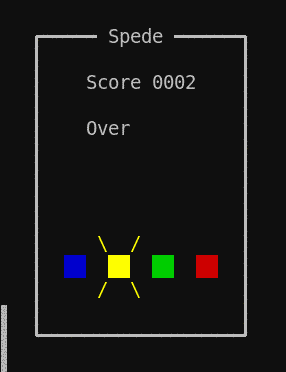

# spede

spede is a reaction speed game known to many Finns by its appearance in the game show Speden Spelit.

The goal in the game is to press the buttons in the order they light up in ever increasing pace. Each correct press is worth one point.

## Controls

- **Space** or **Enter** starts the game
- **h**, **j**, **k** and **l** control the buttons in order
- **Esc** quits

## TODO

- Configuration to set keys and possibly other things
- Highscore list
- Sounds! (Pc beeper preferably)
  - (and a way to mute them)
- Performance/cpu hit could be better

## Thanks

Thanks to [samtay](https://github.com/samtay) for their great
[tutorial](https://samtay.github.io/articles/brick.html) that this
code heavity relies on.
